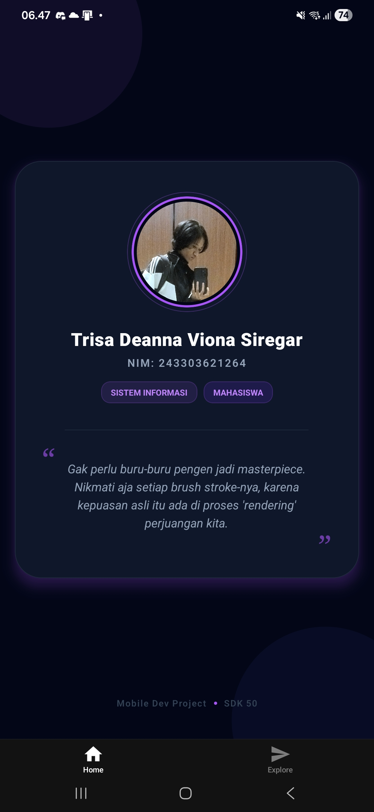

# Project: Kartu Nama Digital 🪪

Tugas praktikum Pertemuan 2 - Pemrograman Mobile.

## 👤 Identitas Mahasiswa

- **Nama:** Trisa Deanna Viona Siregar
- **NIM:** 243303621264
- **Jurusan:** Sistem Informasi

## 📸 Screenshots

## 🛠️ Tech Stack

- **Framework:** React Native (Expo SDK 50)
- **Navigation:** Expo Router
- **Language:** TypeScript

## 🚀 Cara Menjalankan

1. Clone repository ini.
2. Jalankan `npm install`.
3. Jalankan `npx expo start`.
